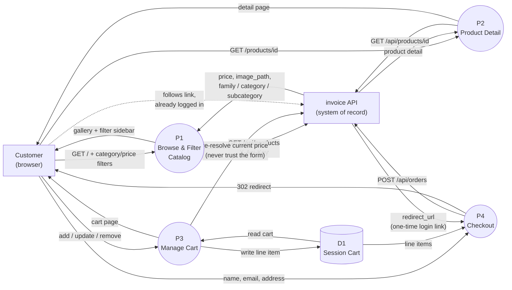

# Webshop — Data Flow (August 2026)

> Webshop holds no product or pricing data of its own. Every catalog read
> and the price re-check on add-to-cart hit invoice's live API; checkout
> doesn't process payment here at all — it ends by handing the customer's
> own browser off to invoice, already logged in, rather than this app
> ever touching money.

## Reading it

- **P1/P2 never cache what invoice returns.** There's no local products
  table to go stale — every page render is a fresh `GET /api/products`
  (or `/{id}`), which is also why the filter sidebar's checkbox options
  and the price-range bounds are always accurate to what's actually
  in stock right now.
- **P3's price re-check is the one arrow that exists purely for safety.**
  `CartController::add()`/`update()` re-resolves the product's current
  price from invoice before writing anything to the session — a
  tampered `POST` can change a quantity, never a unit price. `D1` never
  holds a price this app made up itself.
- **The dotted arrow is the actual point of this app.** `P4` doesn't
  charge a card or redirect to a payment page it built — it POSTs the
  cart to invoice, gets back a one-time login link
  (`STOCK_MOVEMENT_LEDGER_AND_WEBSHOP_API_AUGUST_2026.md` on the invoice
  side covers why a bare invoice URL doesn't work for a brand-new
  customer), and 302s the browser there. From that redirect onward, the
  customer is transacting directly with invoice — all 17 of its payment
  gateways, zero payment code in this repo.

## Out of scope here

TypeScript cart interactivity (not built — see `DESIGN.md`), and
anything on invoice's own side of that final arrow (order creation,
one-time account provisioning, the guest pay page) — that's invoice's
data flow, not this app's.
